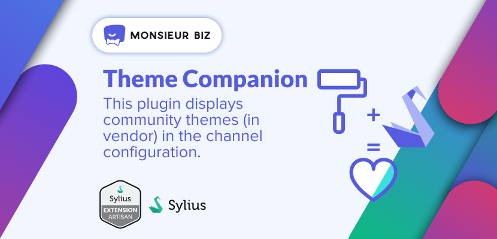

[](https://monsieurbiz.com/agence-web-experte-sylius)

<h1 align="center">Theme Companion for Sylius</h1>

[](https://github.com/monsieurbiz/SyliusThemeCompanionPlugin/blob/master/LICENSE.txt)
[](https://github.com/monsieurbiz/SyliusThemeCompanionPlugin/actions?query=workflow%3ATests)
[](https://github.com/monsieurbiz/SyliusThemeCompanionPlugin/actions?query=workflow%3ASecurity)
[](https://github.com/monsieurbiz/SyliusThemeCompanionPlugin/actions?query=workflow%3ASecurity)

## Compatibility

| Sylius Version | PHP Version     |
|----------------|-----------------|
| 1.12           | 8.1 - 8.2 - 8.3 |
| 1.13           | 8.1 - 8.2 - 8.3 |
| 1.14           | 8.1 - 8.2 - 8.3 |

## Installation

If you want to use our recipes, you can configure your composer.json by running:

```bash
composer config --no-plugins --json extra.symfony.endpoint '["https://api.github.com/repos/monsieurbiz/symfony-recipes/contents/index.json?ref=flex/master","flex://defaults"]'
```

```bash
composer require monsieurbiz/sylius-theme-companion-plugin
```
